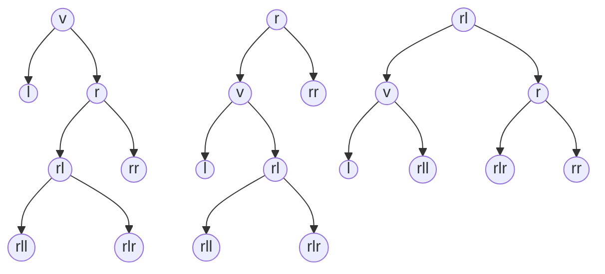

This article introduces a WBT (Weight-Balanced Tree) implementation that outperforms the Linux RBT (Red-Black Tree) in performance. The relevant code is provided at the end of the article. The discussion originates from the implementation of an intrusive heap in [stdexec](https://github.com/NVIDIA/stdexec).
<!--more-->
## Origin

Initially, I encountered an intrusive binary heap implementation in the [stdexec](https://github.com/NVIDIA/stdexec) source code, which was used for timer management. That implementation included parent pointers, enabling arbitrary node removal within the heap. If we don't need the ability to delete arbitrary nodes and remove the parent pointers, how should it be implemented?

Following the textbook approach, when inserting a new node, it is first placed at the rightmost position at the bottom of the tree，and then a sift-up operation is performed. I initially implemented it this way, but without parent pointers, sift-up could only be achieved recursively, which was unsatisfactory. Upon closer inspection, I realized that sifting up a new node essentially involves **retracing the path** it came down until the heap property is satisfied. Could we avoid this retracing? Actually, if we compare the new node with nodes along the path while descending, we can find the exact position where sifting-up should stop. Once the new node takes that position, all subsequent nodes along the path simply need to shift down one level. A more intuitive description is that the insertion of the new node **pushes down** the subsequent nodes along the path.

After implementing this optimization, I attempted to apply it to the version with parent pointers. However, I immediately found that maintaining parent pointers became a nightmare: each sift-up or sift-down operation required updating parent pointers of adjacent nodes, along with numerous edge-case checks. During implementation, I began to doubt the approach... Upon further observation, from the start to the end of a sift-up or sift-down operation, a path is formed. The parent pointers of nodes along this path (except for some boundary nodes) do not actually change. If we extract the singly linked list formed by parent pointers along this path, sift-up essentially moves the tail node to the head, while sift-down moves the head node to the tail. After clarifying these ideas, I refactored the intrusive binary heap in stdexec accordingly, ultimately achieving over **twice** the performance of the original implementation. Consequently, I submitted a [**PR**](https://github.com/NVIDIA/stdexec/pull/1674) to stdexec (which has been merged). The PR mentions a 20% performance improvement on large-scale datasets under the special scenario of "almost no node swaps." In reality, the more node swaps occur, the more significant the performance advantage over the original implementation becomes.

Through the above practice, I gained a key insight: avoiding retracing and adopting a **top-down** maintenance strategy can avoid recursion!

## WBT

When selecting an easy-to-understand and easy-to-implement balanced binary tree, I would first recommend WBT/SBT, followed by AVL. Let's first review the definitions related to WBT. For a node `v`, denote its weight as `v.S`, and its left and right children as `v.L` and `v.R`, respectively. Some articles or code set the weight of leaf nodes to 2, while others set it to 1, this does not affect correctness. For clarity, the following content in this article will uniformly set the weight of leaf nodes to 1. If a WBT is balanced, it satisfies the following conditions:

- `(v.L.S + 1) * ∆ ≥ (v.R.S + 1)`
- `(v.R.S + 1) * ∆ ≥ (v.L.S + 1)`

The parameter `∆` above is used to determine whether the tree is balanced, while the parameter `Γ` controls whether a double rotation is required. When `(v.L.S + 1) * ∆ < (v.R.S + 1)`, node `v` becomes right-leaning. If `(v.R.R.S + 1) * Γ < (v.R.L.S + 1)`, a left double rotation is performed on node `v`; otherwise, only a left single rotation is applied. The left-leaning case is the mirror image of the right-leaning case and requires no further elaboration. In their 2011 paper "Balancing weight-balanced trees", Yoichi Hirai and Kazuhiko Yamamoto have shown that the only integer balancing parameters `<∆,Γ>` for WBT are `<3,2>`.

Although WBT is straightforward to implement, its performance is generally average, and a recursive implementation without parent pointers (typically) performs even worse. As mentioned earlier, **top-down** maintenance can avoid recursion. In this context, the paper [Engineering Top-Down Weight-Balanced Trees](https://arxiv.org/pdf/1910.07849) is noteworthy. The authors provide detailed performance test data for top-down WBT and demonstrate that top-down WBT can outperform Red-Black Trees. Unlike the parent-pointer implementation described in the paper, this article adopts an implementation without parent pointers. Moreover, based on my practical experience, the statement in the paper that "the aforementioned
`<3,2>` possibly is not a feasible choice in the top-down case" is incorrect. I have verified this in two different implementations, and the parameters `<3,2>` remain the correct choice for top-down WBT. If balancing violations occur with these parameters, I suspect there may be an error in the code.

### The Practical Connection Between SBT and WBT

While some people consider SBT to be a variant of WBT, it's important to note that SBT was introduced in 2006, whereas the parameters for WBT were not fully understood until 2011. Therefore, it is not accurate to simply state that "SBT is just a variant of WBT." The issue with SBT lies in its overly strict balance condition, which leads to a complex and difficult-to-optimize recursion in its balance maintenance. What if we appropriately relax this balance condition? When a new node is inserted into the right subtree, node `v` may become right-leaning. The rotation can be performed according to the following rules:

- If `v.R.L.S > v.L.S * 2`, perform a left-double rotation.
- If `v.R.R.S > v.L.S`, perform a left-single rotation.
- Otherwise, no rotation is needed.

The mirror case for left-leaging is omitted here. The key difference in these rotation conditions is the **multiplication by 2** in the double-rotation, which we find is exactly equivalent to the balance parameter `<3,2>` in WBT. The complex recursion can be completely eliminated, and this rotation rule can be interchanged with WBT using the parameter `<3,2>`. It becomes clear that rotation conditions and balance conditions may not be the same! Furthermore, the coefficients for double and single rotations here can be seen as 2 and 1. Would using other values make it fully equivalent to WBT?

### Rotation



When node `v` is right-leaning, a left rotation is required. The middle diagram illustrates a single left rotation, while the rightmost diagram shows a double left rotation. The mirrored case for right rotation is omitted here. Subsequent content and code are described based on the diagrams above.

## First Exploration of Top-Down WBT

Initially, the pseudocode in the paper [Engineering Top-Down Weight-Balanced Trees](https://arxiv.org/pdf/1910.07849) was quite misleading to me. The pseudocode appeared very simple, which drew too much of my attention. However, when I tried to implement it, I quickly ran into obstacles. The rotations triggered by node insertions alter the topology, and some nodes have not yet had their weights updated because the elements are not fully inserted. This makes subsequent steps difficult to proceed. For example, when a new node is inserted into the right subtree `r`, right-leaning may occur. Even with a simple single rotation, both the root node `v` and `r` change. At this point, we still need to determine whether the new node was inserted into the left subtree `rl` or the right subtree `rr` of node `r`. The situation becomes even more complicated with double rotations.

Could we start with a simpler scenario? We notice that during a right rotation, the connection between the left child `l` and the root node `v` does not change. Besides right-leaning caused by inserting nodes into the right subtree, deleting nodes from the left subtree can also lead to right-leaning. Therefore, implementing top-down deletion of the leftmost node would be very straightforward. The code is as follows:

```c++
np_t remove_leftmost() noexcept {
    np_t *cur_ptr = &head;
    np_t cur = head;

    (cur->*Size)--;
    while (!is_sentinel(cur->*Left)) {
        (cur->*Left->*Size)--;
        maintain_right_leaning(*cur_ptr);
        cur_ptr = &(cur->*Left);
        cur = *cur_ptr;
    }
    *cur_ptr = cur->*Right;
    return cur;
}
```

The core logic is under 10 lines! When a left child exists, we first update its weight and perform potential right-leaning maintenance (left rotation). Since left rotation does not break the connection between the left child and the current node, the deletion can proceed. The implementations of `maintain_right_leaning` and `maintain_left_leaning` are as follows:

```c++
static void maintain_right_leaning(np_t &root) noexcept {
    if ((root->*Left->*Size * 3 + 1) < (root->*Right->*Size)) {
        if (root->*Right->*Right->*Size * 2 < (root->*Right->*Left->*Size + 1)) {
            right_rotate(root->*Right);
        }
        left_rotate(root);
    }
}

static void maintain_left_leaning(np_t &root) noexcept {
    if ((root->*Right->*Size * 3 + 1) < root->*Left->*Size) {
        if (root->*Left->*Left->*Size * 2 < (root->*Left->*Right->*Size + 1)) {
            left_rotate(root->*Left);
        }
        right_rotate(root);
    }
}
```

Following this approach, deleting any node is also straightforward. Since this implementation does not include parent pointers, we first perform a search. We can use a bitmap to record the search path: set it to 1 when moving right, and 0 when moving left. If the node to be deleted is found, we use the previously recorded bitmap to restore the path and maintain the nodes along the path during restoration. As there is nothing particularly special about the implementation, the code is not included here, the repository address is provided at the end of the article.

## Attempting Top-Down WBT

Top-down deletion is relatively straightforward to handle, but what about node insertion? Note that rotations only modify a limited set of connections. If we wait until a node descends enough layers relative to the current node before rotating, the operation becomes safe. At this point, my intuitive idea is to maintain a queue, storing the nodes to be traversed downward along with their path information. When the queue depth reaches a level where rotation is safe, we then perform the maintenance. The code is as follows:

```c++
void insert_multi_with_queue(np_t node) noexcept {
    detail::top_down_queue<T> q{};
    np_t *cur_ptr = &head;
    np_t cur = head;
    while (!is_sentinel(cur)) {
        (cur->*Size)++;
        if (cmp(*node, *cur)) {
            q.push_left_path(cur_ptr);
            cur_ptr = &(cur->*Left);
        } else {
            q.push_right_path(cur_ptr);
            cur_ptr = &(cur->*Right);
        }
        if (q.size() > 3) {
            top_down_insert_mainatin(q);
        }
        cur = *cur_ptr;
    }
    insert_leaf(*cur_ptr, node);
    while (q.size() > 1) {
        top_down_insert_mainatin(q);
    }
}
```

It should be noted that top-down node insertion is only applicable in scenarios where duplicate elements are allowed. When the queue depth is greater than 3, meaning the node has descended 4 levels, the weights of nodes along the path have already been updated. At this point, even if the node is added to the left subtree of a `rll` or `rlr` structure and a left double rotation is performed, the operation remains safe. Since a tree can only violate balance when its height is greater than 2, so maintenance is required when more than one element remains in the queue. During each maintenance operation, even if no rotation occurs, one element is popped from the queue, while rotations will pop more. Therefore, this queue implementation only requires a **fixed capacity of at most 4 elements**. Storing each element involves only a pointer and 1 bit of path information, making the implementation **extremely lightweight**. The code for `top_down_insert_maintain` is as follows:

```c++
static void top_down_insert_mainatin(detail::top_down_queue<T> &q) noexcept {
    auto cur_ptr = q.front_pointer();
    np_t cur = *cur_ptr;
    if (q.path_queue() & 1u) { // Right?
        if ((cur->*Left->*Size * 3 + 1) < cur->*Right->*Size) {
            if (cur->*Right->*Right->*Size * 2 < (cur->*Right->*Left->*Size + 1)) {
                right_rotate(cur->*Right);
                left_rotate(*cur_ptr);

                if ((q.path_queue() & 2u) == 0) { // rl
                    cur = *cur_ptr;
                    if (q.path_queue() & 4u) { // rlr
                        q.template pop<3>();
                        q.set_front(&(cur->*Right->*Left));
                    } else { // rll
                        q.template pop<3>();
                        q.set_front(&(cur->*Left->*Right));
                    }
                } else { // rr
                    q.template pop<2>();
                }
            } else {
                left_rotate(*cur_ptr);

                if (q.path_queue() & 2u) { // rr
                    q.template pop<2>();
                } else { // rl
                    q.template pop<2>();
                    q.set_front(&((*cur_ptr)->*Left->*Right));
                }
            }
        } else {
            q.pop();
        }
    } else { // Left
        // Symmetric branch.
    }
}
```

The implementation above may appear complex, but it becomes straightforward when compared with the node rotation diagrams discussed earlier. Taking the simplest single rotation as an example: when a left-leaning single rotation occurs and the new node is inserted into the `rr` subtree, the connection between the `rr` node and its parent `r` remains unchanged after rotation, so we can simply append the elements previously in `rr`. However, if the insertion is into the `rl` subtree, the parent of `rl` changes from `r` to `v` after rotation. Therefore, besides popping elements, we must also set the subsequent elements to `v-rl`. The code above performs rotation first and then updates the queue, but it is also possible to **update the queue first and then rotate**, there is no fundamental difference. The code for maintaining left-leaning and right-leaning cases is symmetric, as shown in the comparison below:


There are still many optimizable details in the above code, but after experimenting with several optimizations, the final performance still falls short of that of RBT. Therefore, only the initial, easy-to-understand implementation is presented here. Even with optimizations, the performance is about 20% slower than RBT for small datasets, and only slightly surpasses it at nearly a million data points. This indicates that although the introduced queue is lightweight, it still incurs significant overhead. Additionally, the queue cannot be fully processed within the main loop, and a small tail remains after the loop. The function `top_down_insert_maintain` generates too many instructions and is not inlined by the compiler, even forcing inlining with attributes results in worse performance. Moreover, this is an implementation without parent pointers, which reduces maintenance overhead and rotation cost. After testing an implementation with parent pointers, performance was unsurprisingly even worse. Thus, this implementation **did not achieve the expected results**.

## Revisiting Top-Down WBT

Previously, we used a queue to help scout the path ahead. Now, removing the queue means we must look one step ahead before moving forward, this is a common technique in top-down balanced tree implementations known as look-ahead. With sufficient look-ahead, we can determine what kind of maintenance is required at the current node. For example, when inserting a node into the right subtree `r` and `r` is not empty, we can update the weight of node `r` and decide whether a rotation is needed. Taking the simplest left single rotation as an example, this rotation involves the left and right subtrees of node `r`. Therefore, we need to look ahead further to see whether the node was inserted into the `rr` or `rl` subtree. During this look-ahead, we update the weights accordingly, after which we can safely perform the rotation and set the next node to maintain as either `rr` or `rl`. Double rotations are similar to single rotations but require more look-ahead steps, which we will not elaborate on here. Finally, the code implementation is as follows:

```c++
void insert_multi(np_t node) noexcept {
    np_t *cur_ptr = &head;
    np_t cur = head;
    if (is_sentinel(cur)) [[unlikely]] {
        insert_leaf(*cur_ptr, node);
        return;
    }
    (cur->*Size)++;
    while (1) {
        if (cmp(*node, *cur)) { // l
            // Symmetric branch.
        } else { // r
            np_t right = cur->*Right;
            if (!is_sentinel(right)) [[likely]] { // look-ahead-1
                (right->*Size)++;
                if ((cur->*Left->*Size * 3 + 1) < right->*Size) [[unlikely]] {
                    bool is_rr = !cmp(*node, *right);
                    nsize_t rr_size = is_rr ? (right->*Right->*Size + 1) : right->*Right->*Size;
                    np_t *ptr = cur_ptr;
                    // rl.S = r.S - rr.S -1
                    if (rr_size * 2 < (right->*Size - rr_size)) { // double-rotate
                        if (is_rr) {                              // rr
                            np_t rr = right->*Right;
                            if (!is_sentinel(rr)) [[likely]] { // look-ahead-2
                                (rr->*Size)++;
                                cur_ptr = &(right->*Right);
                            } else {
                                insert_leaf(right->*Right, node);
                                cur_ptr = nullptr;
                            }
                        } else { // rl
                            np_t rl = right->*Left;
                            if (!is_sentinel(rl)) [[likely]] { // look-ahead-2
                                (rl->*Size)++;
                                if (cmp(*node, *rl)) {                        // rll
                                    if (!is_sentinel(rl->*Left)) [[likely]] { // look-ahead-3
                                        (rl->*Left->*Size)++;
                                        cur_ptr = &(cur->*Right);
                                    } else {
                                        insert_leaf(rl->*Left, node);
                                        cur_ptr = nullptr;
                                    }
                                } else {                                       // rlr
                                    if (!is_sentinel(rl->*Right)) [[likely]] { // look-ahead-3
                                        (rl->*Right->*Size)++;
                                        cur_ptr = &(right->*Left);
                                    } else {
                                        insert_leaf(rl->*Right, node);
                                        cur_ptr = nullptr;
                                    }
                                }
                            } else {
                                insert_leaf(right->*Left, node);
                                cur_ptr = nullptr;
                            }
                        }
                        right_rotate(cur->*Right);
                        left_rotate(*ptr);
                    } else {         // single-rotate
                        if (is_rr) { // rr
                            np_t rr = right->*Right;
                            if (!is_sentinel(rr)) [[likely]] { // look-ahead-2
                                (rr->*Size)++;
                                cur_ptr = &(right->*Right);
                            } else {
                                insert_leaf(right->*Right, node);
                                cur_ptr = nullptr;
                            }
                        } else { // rl
                            np_t rl = right->*Left;
                            if (!is_sentinel(rl)) [[likely]] { // look-ahead-2
                                (rl->*Size)++;
                                cur_ptr = &(cur->*Right);
                            } else {
                                insert_leaf(right->*Left, node);
                                cur_ptr = nullptr;
                            }
                        }
                        left_rotate(*ptr);
                    }
                    if (cur_ptr == nullptr) [[unlikely]] {
                        return;
                    }
                    cur = *cur_ptr;
                } else {
                    cur_ptr = &(cur->*Right);
                    cur = right;
                }
            } else {
                insert_leaf(cur->*Right, node);
                return;
            }
        }
    }
}
```

The code above may appear lengthy, but it corresponds directly to the rotation diagrams presented earlier. When viewed alongside the diagrams, it is not complex. Moreover, the code for maintaining left-leaning and right-leaning structures is symmetrical, as shown in the following comparison:


## Performance Testing

Now that we have a top-down WBT element insertion implementation, let's run some performance tests! I compared Linux's RBT and FreeBSD's RBT, using Google Benchmark to test insertion with random and ordered data. It should be noted that FreeBSD's RBT stands for Rank-Balanced Tree, which implements a Weak AVL. For more details, see the paper [Rank-Balanced Trees](https://rtheunissen.github.io/bst/docs/references/2013_rank_balanced_trees.pdf).

The performance test results for random data insertion are as follows:


| scale   | linux irbt | freebsd irbt | irwbt      |
| ------- | ---------- | ------------ | ---------- |
| 1024    | 37780      | 27898        | 29775      |
| 2048    | 101970     | 75574        | 86268      |
| 4096    | 241669     | 188178       | 218545     |
| 8192    | 561326     | 446654       | 514644     |
| 16384   | 1371841    | 1129207      | 1265200    |
| 32768   | 3433907    | 2915927      | 3139166    |
| 65536   | 8050383    | 7041647      | 7555449    |
| 131072  | 18974939   | 16798772     | 18014849   |
| 262144  | 47169571   | 42136090     | 45503752   |
| 524288  | 144088757  | 125782610    | 132100588  |
| 1048576 | 415307617  | 414126047    | 392497038  |
| 2097152 | 1162108168 | 1185433450   | 1131238760 |

The performance test results for sequential data insertion are as follows:


| scale   | linux irbt | freebsd irbt | irwbt     |
| ------- | ---------- | ------------ | --------- |
| 1024    | 21578      | 22990        | 21427     |
| 2048    | 49296      | 50705        | 48910     |
| 4096    | 113439     | 111538       | 109387    |
| 8192    | 248274     | 245300       | 243899    |
| 16384   | 609163     | 539768       | 562408    |
| 32768   | 1545364    | 1176566      | 1388003   |
| 65536   | 3857833    | 2535402      | 3629135   |
| 131072  | 9387009    | 5653928      | 9006618   |
| 262144  | 21928361   | 16826570     | 21289181  |
| 524288  | 46815194   | 41583137     | 50829225  |
| 1048576 | 117410461  | 107566266    | 107938783 |
| 2097152 | 279744033  | 240376111    | 235410475 |

It can be observed that the insertion performance of top-down WBT lies between Linux RBT and FreeBSD RBT, though it must be said that Weak AVL is quite competitive. However, in element deletion scenarios, Linux RBT performs the best, while WBT and Weak AVL show no advantage, so the test results are not included here.

## Summary

The prerequisite for maintaining a balanced tree in a top-down manner is the ability to perform balancing operations with **limited look-ahead**. The parameter `<3,2>` remains the correct choice for top-down WBT. Although the queue-based implementation of top-down WBT does not perform well, its simplicity makes it a quick and general method for verifying the feasibility of top-down tree maintenance. After removing the queue, we obtained a WBT implementation that outperforms Linux's RBT in element insertion. For both insertion and deletion, we can achieve a fully iterative implementation without recursion, even without using parent pointers.

The above top-down WBT implementation is relatively primitive and may have room for optimization. One approach is to reduce node accesses. For example, when inserting an element into the right subtree, the weight of the left subtree can be obtained by subtracting the right subtree's weight from the current node's weight. Even if a left rotation occurs, we can still avoid accessing the left subtree, which may offer advantages at larger data scales.

Finally, the repository is available at: [https://github.com/TypeCombinator/uit](https://github.com/TypeCombinator/uit). The relevant code discussed in this article is located in the file [include/uit/irwbt.hpp](https://github.com/TypeCombinator/uit/blob/main/include/uit/irwbt.hpp).