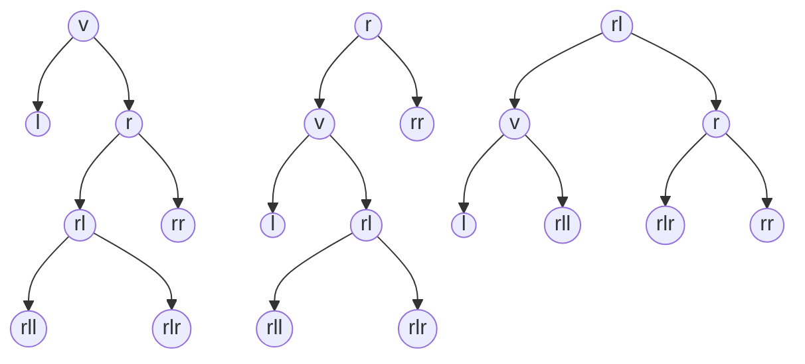

本文将介绍一种比Linux RBT性能更好的WBT实现，相关代码见文末，事情的起因要从stdexec的侵入式堆的实现开始。
<!--more-->
## 源起

最初，我在stdexec的源码中看到了一个侵入式二叉堆的实现，它用于管理定时器，该实现是带有parent指针的，所以能实现堆中的任意节点删除。如果不需要任意节点的删除功能，并移除parent指针，又该如何实现呢？

按照教科书的做法，当加入新节点时，先将该节点放到尾部，即树底的最右侧，之后再对该节点进行上浮操作，起初我也是这么实现的，但由于去掉了parent指针，上浮只能用递归实现，这不太让人满意。仔细观察了一下，发现新节点的上浮其实是在沿着下来的路径做**原路返回**，直到满足堆的性质才停止，那么能否不做这种折返呢？其实，如果在节点沿着路径下来的时候与沿路节点比较就能找到停止上浮的位置，当新节点取代该位置后，路径上的所有后续节点只需要逐个往下移动一层即可。更为形象的描述是，新节点的加入使得后续节点被沿着路径**挤下**去了。

在完成以上想法后，我尝试将该优化带入到有parent指针的实现中，但立刻发现parent指针的维护成为了灾难，每次节点的上浮或下沉都要更新相邻节点的parent指针，而且需要对各种边界情形判断，在实现的过程当中我就产生了自我怀疑……再次观察了下，从上浮或下沉的开始到结束会形成一条路径，该路径上的节点（除一些边界节点）的parent指针并没有改变，如果我们将路径上由parent指针构成的单链表拿出来看，上浮其实是将链表尾部节点移动到头部，而下沉则是将链表头部的节点移动到尾部。把这些想法捋清之后，也是将stdexec的侵入式二叉堆重构了一番，最终获得了较原实现2倍多的性能，于是顺带给stdexec提了一个[PR](https://github.com/NVIDIA/stdexec/pull/1674)（已被合入），而PR中提到的大规模数据集下20%的性能提升，是在“几乎没有节点交换”的特殊场景，实际上，发生节点交换的越多，较原实现的性能优势会越显著。

经过以上实践，我获得了一个关键启示：不做往返，采用**自顶向下**的维护策略，可以避免递归！

## WBT

如果要选一种易懂好写的二叉平衡树，那么我会首推WBT/SBT，其次是AVL。这里先回顾一下WBT相关定义，对于节点`v`，记权重为`v.S`，左右节点分别表示为`v.L`和`v.R`，有的文章或代码将叶子节点权重设置为2，也有的设置为1，这并不影响正确性，为了明确，本文后续内容统一将叶子节点的权重设置为1。如果WBT平衡，则满足以下条件：

- `(v.L.S + 1) * ∆ ≥ (v.R.S + 1)`
- `(v.R.S + 1) * ∆ ≥ (v.L.S + 1)`

以上的参数`∆`用于判断是否平衡，而参数`Γ`则用于控制是否双旋，当`(v.L.S + 1) * ∆ < (v.R.S + 1)`时，节点`v`发生了右倾，如果`(v.R.R.S + 1) * Γ < (v.R.L.S + 1)`，则对节点`v`向左双旋，否则只对节点`v`向左单旋。而树`v`左倾是右倾的镜像情形，此处无需赘述。Yoichi Hirai的Kazuhiko Yamamoto在2011年的论文[Balancing weight-balanced trees](https://yoichihirai.com/bst.pdf)中已经指明，WBT唯一整数平衡参数`<∆,Γ>`是`<3,2>`。

WBT虽然好写，但性能表现一般，而不带parent指针的递归实现（通常）性能则更差。前面提到**自顶向下**的维护可以避免递归，此时不得不提[Engineering Top-Down Weight-Balanced Trees](https://arxiv.org/pdf/1910.07849)这篇论文了，该作者在文中给出了自顶向下WBT的详细性能测试数据，也证明了自顶向下的WBT是可以比RBT性能更好的。有别于该论文的带parent指针的实现，本文使用了不带parent指针的实现，而且经过笔者实践，文中提到的「参数`<3,2>`在自顶向下的情况下可能并非可行选择」这句话并不正确，笔者在2种不同的实现下验证，参数`<3,2>`依然是自顶向下WBT正确的选择，如果在该参数下出现违反平衡，笔者认为可能是代码哪里没写对。

### SBT与WBT的切实联系

虽然有人认为SBT是WBT的一个变体，但要论正确性，SBT在2006年就出现了，而WBT的参数直到2011年才弄明白，所以并不能简单地用一句「SBT只是WBT的变体」来概括。SBT的问题在于其平衡条件设置的太严格了，这导致平衡维护里出现了那个难以优化的复杂的递归，如果将其平衡条件适当地放宽呢？当新节点插入右子树，节点`v`可能会右倾，可按如下规则旋转：

- 如果`v.R.L.S > v.L.S * 2`，则进行左双旋
- 如果`v.R.R.S > v.L.S`，则进行左单旋
- 其他，不旋转

左倾为镜像情形，此处省略，以上旋转条件的关键不同在于双旋判定条件中的**乘以2**，此时我们会发现这正好等价于WBT中`<3,2>`这个平衡参数，复杂的递归也可以完全去掉，且该旋转规则可以和参数为`<3,2>`的WBT互相替换。可以看到，旋转条件和平衡判定条件可能并不一样！进一步地，以上双旋和单旋的系数可以看作是2和1，如果是其他值是否就和WBT完全等价了呢？

### 旋转



当节点`v`右倾时需要向左旋转，中间为左单旋的示意图，最右侧为左双旋的示意图。对于右旋转的镜像情形，此处省略。后续的内容和代码都基于以上示意图描述。

## 初探自顶向下WBT

起初，[Engineering Top-Down Weight-Balanced Trees](https://arxiv.org/pdf/1910.07849)这篇论文中的伪代码给了我很大的误导，因为这份伪代码看起来非常简单，吸引了我太多注意力，一试之下很快就碰壁了，因为节点加入引发的旋转会改变拓扑，而且部分节点由于元素还未加入，权重也没更新，使得后续步骤难以进行，比如当新节点加入右子树`r`，可能发生右倾，即使是最简单的单旋，根节点`v`和`r`也发生了变化，这个时候还需要先判断新节点加入了节点`r`的左子树`rl`，还是右子树`rr`，而双旋的情形就更为麻烦了。

那能不能先从一个简单情形开始呢？我们注意到，发生右旋时，左子节点`l`和根节点`v`的连接关系并没有发生改变，除了向右加入节点会发生右倾以外，删除左子树的节点也有可能发生右倾，所以如果实现自顶向下删除最左节点的实现会非常简单，代码如下：

```c++
np_t remove_leftmost() noexcept {
    np_t *cur_ptr = &head;
    np_t cur = head;

    (cur->*Size)--;
    while (!is_sentinel(cur->*Left)) {
        (cur->*Left->*Size)--;
        maintain_right_leaning(*cur_ptr);
        cur_ptr = &(cur->*Left);
        cur = *cur_ptr;
    }
    *cur_ptr = cur->*Right;
    return cur;
}
```

以上代码主体还不到10行！当左节点存在时，先更新左节点权重，并进行可能的右倾维护（左旋转），而左旋转并不会破坏左子节点与当前节点连接关系，使得删除操作能继续进行下去。而`maintain_right_leaning`和``maintain_left_leaning``的实现如下：

```c++
static void maintain_right_leaning(np_t &root) noexcept {
    if ((root->*Left->*Size * 3 + 1) < (root->*Right->*Size)) {
        if (root->*Right->*Right->*Size * 2 < (root->*Right->*Left->*Size + 1)) {
            right_rotate(root->*Right);
        }
        left_rotate(root);
    }
}

static void maintain_left_leaning(np_t &root) noexcept {
    if ((root->*Right->*Size * 3 + 1) < root->*Left->*Size) {
        if (root->*Left->*Left->*Size * 2 < (root->*Left->*Right->*Size + 1)) {
            left_rotate(root->*Left);
        }
        right_rotate(root);
    }
}
```

 基于以上思路，任意节点的删除也很容易实现。由于是不带parent指针的实现，需要先进查找，我们可以用一个位图记录查找路径，向右走就置1，向左走就置0，如果找到了待删除的节点，就用之前的位图恢复下来的路径，并在恢复的过程中维护路径上的节点即可。由于实现没有什么特殊之处，因此代码就不贴在这里了，文末有仓库地址。

## 尝试自顶向下WBT

自顶向下的节点删除倒是容易解决，但节点加入呢？注意到，旋转改变的连接关系是有限的，如果等节点向下加入到相对当前节点层数足够多的时候，再旋转就是安全的了。到此，我的直觉想法是维护一个队列，将待向下经过的节点以及路径信息存入，等队列深度达到可以安全旋转的时候再进行维护，代码如下：

```c++
void insert_multi_with_queue(np_t node) noexcept {
    detail::top_down_queue<T> q{};
    np_t *cur_ptr = &head;
    np_t cur = head;
    while (!is_sentinel(cur)) {
        (cur->*Size)++;
        if (cmp(*node, *cur)) {
            q.push_left_path(cur_ptr);
            cur_ptr = &(cur->*Left);
        } else {
            q.push_right_path(cur_ptr);
            cur_ptr = &(cur->*Right);
        }
        if (q.size() > 3) {
            top_down_insert_mainatin(q);
        }
        cur = *cur_ptr;
    }
    insert_leaf(*cur_ptr, node);
    while (q.size() > 1) {
        top_down_insert_mainatin(q);
    }
}
```

需要说明的是，自顶向下的节点插入只适用于有允许重复元素的场景，当队列深度大于3，即节点已经向下了4层，路径上的节点的权重已完成更新，即使是节点加入到`rll`  或`rlr`子树的左双旋也是安全的，而树高只有在大于2的时候才可能违反平衡，因此需要对在队列剩余元素大于1的时候进行维护。每次进行维护时，即使没有旋转也会弹出队列中的一个元素，而旋转则会弹出更多，因此这个队列的实现只需要**最大4个元素的固定容量**即可，每次存入元素只是一个指针和1比特的路径信息，实现也是**非常轻量**。其中`top_down_insert_mainatin`代码如下：

```c++
static void top_down_insert_mainatin(detail::top_down_queue<T> &q) noexcept {
    auto cur_ptr = q.front_pointer();
    np_t cur = *cur_ptr;
    if (q.path_queue() & 1u) { // Right?
        if ((cur->*Left->*Size * 3 + 1) < cur->*Right->*Size) {
            if (cur->*Right->*Right->*Size * 2 < (cur->*Right->*Left->*Size + 1)) {
                right_rotate(cur->*Right);
                left_rotate(*cur_ptr);

                if ((q.path_queue() & 2u) == 0) { // rl
                    cur = *cur_ptr;
                    if (q.path_queue() & 4u) { // rlr
                        q.template pop<3>();
                        q.set_front(&(cur->*Right->*Left));
                    } else { // rll
                        q.template pop<3>();
                        q.set_front(&(cur->*Left->*Right));
                    }
                } else { // rr
                    q.template pop<2>();
                }
            } else {
                left_rotate(*cur_ptr);

                if (q.path_queue() & 2u) { // rr
                    q.template pop<2>();
                } else { // rl
                    q.template pop<2>();
                    q.set_front(&((*cur_ptr)->*Left->*Right));
                }
            }
        } else {
            q.pop();
        }
    } else { // Left
        // Symmetric branch.
    }
}
```

以上实现看起来复杂，但对照前文的节点旋转示意图会非常容易理解。以最简单的单旋为例，当发生左单旋，且新节点加入的是`rr`子树时，由于旋转之后的`rr`节点和父节点`r`的连接关系没有变化，因此只需直接加入`rr`节点之前的元素即可；而如果加入的是`rl`子树，旋转之后，`rl`的父节点由`r`变为了`v`，因此除了要弹出元素之外，还要将后续元素设置为`v-rl`。左右维护的代码是对称的，对比如下：


以上代码实际还有许多可以优化的细节，但尝试一些优化之后，最终得到的性能还是比RBT要差，所以就只在这里放上易懂的初始实现。即使是优化后的实现，在少量数据时，较RBT慢了20%左右，直到近百万数据规模时才有轻微的反超，可见虽然引入的队列非常轻量，但依然产生了不小的开销。其次是队列不能在主循环里处理完，主循环之后还有个小尾巴，函数`top_down_insert_mainatin`产生的指令还是太多了，编译器并没有将其内联，即使加属性强行内联，性能反而会更差。而且，这还是没有parent指针的实现，少了许多维护开销，旋转代价也更小，用带parent指针的实现并测试后，不出意料地，性能差了更多，所以该实现**未能达到预期效果**。

## 再探自顶向下WBT

前面我们用队列帮忙把路探好，现在要把队列去掉，就只能是看一步走一步了，这其实是自顶向下平衡树实现的通用技巧——look-ahead，只要有足够的look-ahead，就能知道在当前节点需要进行什么样的维护。比如节点加入右子树`r`，且`r`非空，那么此时可以更新节点`r`的权重，并判断是否要进行旋转，以最简单的左单旋为例，该旋转会涉及到节点`r`的左右子树，因此还需要再look-ahead一下，看节点是加入了`rr`还是`rl`子树，并在look-ahead时完成权重更新，之后就可以安全地旋转，并将下一轮维护待维护的节点设置为对应的`rr`或`rl`。而双旋相较单旋只是需要更多的look-ahead罢了，此处不再赘述。最终，代码实现如下：

```c++
void insert_multi(np_t node) noexcept {
    np_t *cur_ptr = &head;
    np_t cur = head;
    if (is_sentinel(cur)) [[unlikely]] {
        insert_leaf(*cur_ptr, node);
        return;
    }
    (cur->*Size)++;
    while (1) {
        if (cmp(*node, *cur)) { // l
            // Symmetric branch.
        } else { // r
            np_t right = cur->*Right;
            if (!is_sentinel(right)) [[likely]] { // look-ahead-1
                (right->*Size)++;
                if ((cur->*Left->*Size * 3 + 1) < right->*Size) [[unlikely]] {
                    bool is_rr = !cmp(*node, *right);
                    nsize_t rr_size = is_rr ? (right->*Right->*Size + 1) : right->*Right->*Size;
                    np_t *ptr = cur_ptr;
                    // rl.S = r.S - rr.S -1
                    if (rr_size * 2 < (right->*Size - rr_size)) { // double-rotate
                        if (is_rr) {                              // rr
                            np_t rr = right->*Right;
                            if (!is_sentinel(rr)) [[likely]] { // look-ahead-2
                                (rr->*Size)++;
                                cur_ptr = &(right->*Right);
                            } else {
                                insert_leaf(right->*Right, node);
                                cur_ptr = nullptr;
                            }
                        } else { // rl
                            np_t rl = right->*Left;
                            if (!is_sentinel(rl)) [[likely]] { // look-ahead-2
                                (rl->*Size)++;
                                if (cmp(*node, *rl)) {                        // rll
                                    if (!is_sentinel(rl->*Left)) [[likely]] { // look-ahead-3
                                        (rl->*Left->*Size)++;
                                        cur_ptr = &(cur->*Right);
                                    } else {
                                        insert_leaf(rl->*Left, node);
                                        cur_ptr = nullptr;
                                    }
                                } else {                                       // rlr
                                    if (!is_sentinel(rl->*Right)) [[likely]] { // look-ahead-3
                                        (rl->*Right->*Size)++;
                                        cur_ptr = &(right->*Left);
                                    } else {
                                        insert_leaf(rl->*Right, node);
                                        cur_ptr = nullptr;
                                    }
                                }
                            } else {
                                insert_leaf(right->*Left, node);
                                cur_ptr = nullptr;
                            }
                        }
                        right_rotate(cur->*Right);
                        left_rotate(*ptr);
                    } else {         // single-rotate
                        if (is_rr) { // rr
                            np_t rr = right->*Right;
                            if (!is_sentinel(rr)) [[likely]] { // look-ahead-2
                                (rr->*Size)++;
                                cur_ptr = &(right->*Right);
                            } else {
                                insert_leaf(right->*Right, node);
                                cur_ptr = nullptr;
                            }
                        } else { // rl
                            np_t rl = right->*Left;
                            if (!is_sentinel(rl)) [[likely]] { // look-ahead-2
                                (rl->*Size)++;
                                cur_ptr = &(cur->*Right);
                            } else {
                                insert_leaf(right->*Left, node);
                                cur_ptr = nullptr;
                            }
                        }
                        left_rotate(*ptr);
                    }
                    if (cur_ptr == nullptr) [[unlikely]] {
                        return;
                    }
                    cur = *cur_ptr;
                } else {
                    cur_ptr = &(cur->*Right);
                    cur = right;
                }
            } else {
                insert_leaf(cur->*Right, node);
                return;
            }
        }
    }
}
```

以上代码看起来多，但是和前文的旋转示意图是完全对应的，对着图看并不复杂，而左右维护的代码是对称的，对比如下：


## 性能测试

到此，我们得到了一个自顶向下WBT元素插入的实现，做一下性能测试吧！我将Linux的RBT和FreeBSD的RBT作为对比，用Google Benchmark测试了随机和有序数据插入。需要说明的是，FreeBSD的RBT全称是Rank-Balanced Tree，其中实现的是Weak AVL，相关内容见[Rank-Balanced Trees](https://rtheunissen.github.io/bst/docs/references/2013_rank_balanced_trees.pdf)这篇论文。

随机数据插入性能测试如下：


| scale   | linux irbt | freebsd irbt | irwbt      |
| ------- | ---------- | ------------ | ---------- |
| 1024    | 37780      | 27898        | 29775      |
| 2048    | 101970     | 75574        | 86268      |
| 4096    | 241669     | 188178       | 218545     |
| 8192    | 561326     | 446654       | 514644     |
| 16384   | 1371841    | 1129207      | 1265200    |
| 32768   | 3433907    | 2915927      | 3139166    |
| 65536   | 8050383    | 7041647      | 7555449    |
| 131072  | 18974939   | 16798772     | 18014849   |
| 262144  | 47169571   | 42136090     | 45503752   |
| 524288  | 144088757  | 125782610    | 132100588  |
| 1048576 | 415307617  | 414126047    | 392497038  |
| 2097152 | 1162108168 | 1185433450   | 1131238760 |

顺序数据插入性能测试如下：


| scale   | linux irbt | freebsd irbt | irwbt     |
| ------- | ---------- | ------------ | --------- |
| 1024    | 21578      | 22990        | 21427     |
| 2048    | 49296      | 50705        | 48910     |
| 4096    | 113439     | 111538       | 109387    |
| 8192    | 248274     | 245300       | 243899    |
| 16384   | 609163     | 539768       | 562408    |
| 32768   | 1545364    | 1176566      | 1388003   |
| 65536   | 3857833    | 2535402      | 3629135   |
| 131072  | 9387009    | 5653928      | 9006618   |
| 262144  | 21928361   | 16826570     | 21289181  |
| 524288  | 46815194   | 41583137     | 50829225  |
| 1048576 | 117410461  | 107566266    | 107938783 |
| 2097152 | 279744033  | 240376111    | 235410475 |

可以看到，自顶向下WBT的元素插入性能介于Linux RBT和FreeBSD RBT之间，但也不得不说Weak AVL非常能打。不过在元素删除的场景Linux RBT却是最好的，而WBT和Weak AVL没有优势，所以就不在此贴测试结果了。

## 总结

自顶向下维护平衡树的前提是能进行**有限的look-ahead**，而参数`<3,2>`依然是自顶向下WBT的正确选择。虽然用队列实现的自顶向下WBT性能不佳，但由于实现简单，也不失为验证自顶向下维护平衡树的一个快速且通用的方法，在去除队列之后，我们得到了一个比Linux RBT元素加入性能更好的WBT实现。无论是元素插入还是删除，即使不用parent指针，我们依然可以完全用迭代实现，而不需要使用递归。

另外，自顶向下WBT的实现可能还有一些优化的空间，一种方式是减少节点访问，比如向右子树加入元素时，左子树权重可以用当前节点权重减去右子树权重获得，即使发生了左旋转，我们依然可以避免访问到左子树，这可能在数据规模较大时会有一定的优势。

最后附上仓库地址：[https://github.com/TypeCombinator/uit](https://github.com/TypeCombinator/uit)，文中相关代码位于[include/uit/irwbt.hpp](https://github.com/TypeCombinator/uit/blob/main/include/uit/irwbt.hpp)文件中。
